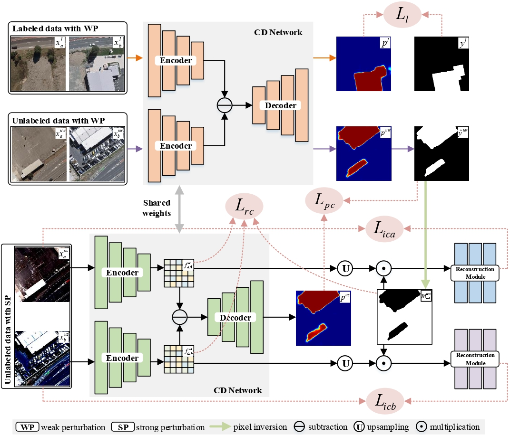

# LGTC: Local–Global Tri-Consistency Network
Here, we provide the pytorch implementation of the paper: LGTC: Local–Global Tri-Consistency Network for Semi-Supervised Change Detection of Remote Sensing Images.

For more information, please see our published paper at [TGRS](https://ieeexplore.ieee.org/document/11196991).



## Installation

Clone this repo:

```shell
git clone https://github.com/sherryxu21/LGTC.git
cd LGTC
```

## Train

```
python train.py
```

## Evaluate

```
python inference.py
```

## Data structure

```
├─A
├─B
├─label
└─list
  └─5_train_unsupervised.txt
  └─5_train_supervised.txt
  └─val.txt
  └─test.txt
```

## Citation
If you use this code for your research, please cite our paper:

```
@ARTICLE{11196991,
  author={Liu, Jiamin and Xu, Rui and Luo, Fulin and Fu, Chuan and Guo, Tan and Shi, Qian and Du, Bo},
  journal={IEEE Transactions on Geoscience and Remote Sensing}, 
  title={LGTC: Local–Global Tri-Consistency Network for Semi-Supervised Change Detection of Remote Sensing Images}, 
  year={2025},
  volume={63},
  number={},
  pages={1-13},
  keywords={Feature extraction;Remote sensing;Semantics;Transformers;Perturbation methods;Robustness;Image reconstruction;Data models;Convolutional neural networks;Context modeling;Change detection (CD);remote sensing (RS);semi-supervised learning (SSL);tri-consistency learning (TCL)},
  doi={10.1109/TGRS.2025.3619036}}
```

## License

Code is released for non-commercial and research purposes **only**. For commercial purposes, please contact the authors.

## Acknowledgements
Appreciate the work from the following repository: [FPA-SSCD](https://github.com/zxt9/FPA-SSCD).
